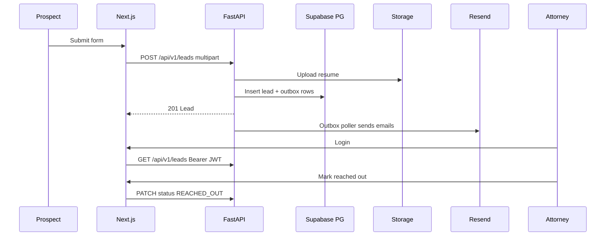

# Leads Portal (Northbridge)

Public lead intake for prospects and an authenticated admin console for attorneys.

**Stack:** Next.js (Vercel) · FastAPI (Railway) · Supabase (Postgres / Storage / Auth) · Resend

## Functionality

| Area | What it does |
|---|---|
| Public form | Collects first name, last name, email, and resume/CV (PDF/DOC/DOCX, ≤10MB) |
| Email | After submit, queues confirmation to the prospect and a notification to the attorney |
| Admin list | Attorneys see all lead fields, open resumes, and refresh the pipeline |
| Status | Each lead starts as `PENDING`; attorney marks `REACHED_OUT` after outreach |
| Storage | Resumes in private Supabase Storage (local `uploads/` in development) |
| Auth | Supabase Auth for attorneys (JWT on API); `/login` + `/signup`. Public create stays open. Local `DEV_AUTH_BYPASS` is **not** production auth |
| Shared inbox | All authenticated attorneys see all leads (per PRD). Claim fields prevent double `REACHED_OUT` |

## User flows

### Prospect

1. Open the public home page.
2. Fill name, email, and attach a resume.
3. Submit → lead is stored as `PENDING`, resume uploaded, emails queued.
4. Prospect receives a confirmation email (when Resend is enabled).

### Attorney

1. Open `/login` (or `/signup` to create an account) with Supabase Auth (or local dev bypass).
2. Land on `/admin/leads`.
3. Review name, email, resume, status, and submitted time.
4. Open the resume (signed URL or authenticated local download).
5. Click **Mark reached out** → status becomes `REACHED_OUT` (one-way transition).



## Tutorial (local)

Prerequisites: Node 20+, Python 3.13+, [uv](https://github.com/astral-sh/uv), PostgreSQL 16.

```bash
# 1. Database (Homebrew example)
brew services start postgresql@16
createdb leads

# 2. API
cd apps/api
cp .env.example .env
# set DATABASE_URL for your local Postgres user
uv sync
uv run alembic upgrade head
uv run uvicorn app.main:app --reload --port 8000

# 3. Web (another terminal)
cd apps/web
cp .env.example .env.local
npm install
npm run dev
```

Open [http://localhost:3000](http://localhost:3000).

With `DEV_AUTH_BYPASS=true` and `NEXT_PUBLIC_DEV_AUTH_BYPASS=true`, use **Attorney login → Enter admin** (Bearer `dev-token`). That skips real Supabase Auth for local smoke tests only. Emails are logged when `EMAIL_ENABLED=false`.

For real attorney login locally or in production: set Supabase URL/keys, create an Auth user, set both bypass flags to `false`, and sign in at `/login`.

Full detail: [docs/RUN_LOCALLY.md](docs/RUN_LOCALLY.md) · Production: [docs/DEPLOY.md](docs/DEPLOY.md)

## Code structure

```
leads-portal/
├── apps/
│   ├── api/                          # FastAPI service (Railway)
│   │   ├── alembic/                  # DB migrations
│   │   │   └── versions/001_initial.py
│   │   ├── app/
│   │   │   ├── main.py               # App factory, CORS, outbox lifespan poller
│   │   │   ├── api/routes/
│   │   │   │   ├── health.py         # /health
│   │   │   │   └── leads.py          # CRUD + local file download
│   │   │   ├── core/
│   │   │   │   ├── config.py         # Settings / env
│   │   │   │   └── security.py       # Supabase JWT + dev bypass
│   │   │   ├── db/                   # SQLAlchemy base + async session
│   │   │   ├── models/               # Lead, EmailOutbox
│   │   │   ├── schemas/              # Pydantic request/response
│   │   │   └── services/
│   │   │       ├── leads.py          # Create/list/update + validation
│   │   │       ├── storage.py        # Supabase Storage or local disk
│   │   │       ├── email.py          # Resend / log sender
│   │   │       └── outbox.py         # Enqueue + claim/send/retry
│   │   ├── Dockerfile
│   │   └── railway.toml
│   └── web/                          # Next.js App Router (Vercel)
│       └── src/
│           ├── app/
│           │   ├── page.tsx          # Public lead form
│           │   ├── login/            # Attorney sign-in
│           │   └── admin/leads/      # Guarded leads table
│           ├── lib/
│           │   ├── api.ts            # API client helpers
│           │   └── supabase/         # Browser/server/middleware clients
│           └── middleware.ts         # Protect /admin/*
├── docs/
│   ├── DESIGN.md
│   ├── RUN_LOCALLY.md
│   ├── DEPLOY.md
│   └── AGENT_USAGE.md
├── supabase/schema.sql               # Reference DDL for Supabase SQL editor
├── docker-compose.yml                # Optional local Postgres
├── NOTES.md                          # Agent vs hand-written attribution
└── README.md
```

**Review tips**

- Start at `apps/api/app/api/routes/leads.py` for the HTTP surface.
- Follow create → `services/leads.py` → `services/outbox.py` → `main.py` lifespan for the write path.
- Admin auth: `apps/web/src/middleware.ts` + `apps/api/app/core/security.py`.

## Docs

- [Design](docs/DESIGN.md) — choices, sizing, caveats & risks
- [Run locally](docs/RUN_LOCALLY.md)
- [Deploy](docs/DEPLOY.md) — Vercel + Railway + Supabase + Resend
- [Agent usage](docs/AGENT_USAGE.md)
- [Attribution](NOTES.md)
